# pfSense Firewall Lab — DoS Simulation & IDS/IPS Detection

## Overview

This project implements a small virtualized network to study how a perimeter firewall (pfSense) handles a Denial-of-Service (DoS) attack from an external host. The lab consists of three virtual machines — **pfSense** (firewall), **Kali Linux** (attacker), and **Ubuntu Desktop** (victim) — used to:


1. Stand up an isolated internal network behind a firewall
2. Simulate a SYN flood attack with `hping3`
3. Capture and analyze the attack traffic with Wireshark
4. Mitigate the attack using pfSense firewall rules and review the resulting logs
5. Deploy Suricata as an IDS/IPS on pfSense to detect and automatically block malicious traffic based on signature rules, without relying on manually written firewall rules

## Lab Architecture

| Device | Network | IP / Subnet | Role |
|---|---|---|---|
| Home Network | Physical | 192.168.1.0/24 | Provides internet access |
| pfSense — WAN | Bridged | 192.168.1.162/24 (DHCP) | Edge firewall interface facing home network |
| pfSense — LAN | Internal (`intnet`) | 192.168.2.1/24 | Internal firewall interface |
| Kali Linux (Attacker) | Bridged | 192.168.1.125/24 (DHCP) | External attacker host |
| Ubuntu Desktop (Victim) | Internal (`intnet`) | 192.168.2.10 (DHCP) | Internal victim host |

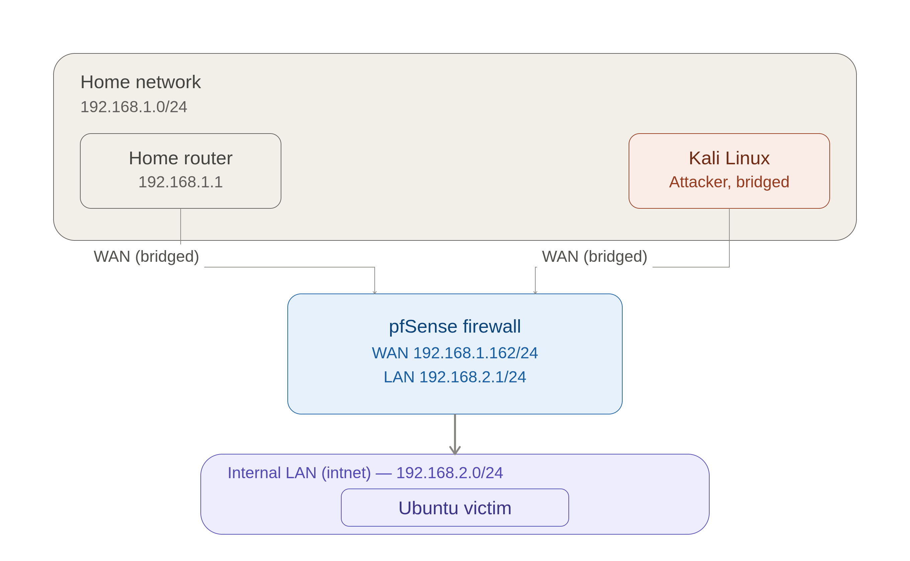


## Part 1 — Installation and Configuration

### 1.1 Virtual Machines

**pfSense**
- FreeBSD 64-bit, 2 vCPU, 2 GB RAM, 20 GB disk
- Adapter 1: Bridged (WAN)
- Adapter 2: Internal Network → `intnet` (LAN)
- Installed edition: pfSense CE (Community Edition)
- Filesystem: ZFS (Stripe, single disk)

**Ubuntu Desktop (Victim)**
- Ubuntu 64-bit, 2 vCPU, 2 GB RAM, 15 GB disk
- Adapter 1: Internal Network → `intnet`

**Kali Linux (Attacker)**
- Ubuntu 64-bit, 2 vCPU, 2 GB RAM, 15 GB disk
- Adapter 1: Bridged (WAN)

### 1.2 Interface Assignment

Interfaces were assigned via the pfSense console:
- WAN → `em0`
- LAN → `em1`

### 1.3 Network Addressing

The LAN interface was manually set to `192.168.2.1/24` to avoid a subnet conflict with the home network (which also uses `192.168.1.0/24`).

### 1.4 Enabling GUI Access

The firewall was temporarily disabled from the console shell to allow first-time login:

```bash
pfctl -d
```

The web interface was then reached at `https://192.168.1.162` using the default credentials (`admin` / `pfsense`). A permanent rule was created to preserve GUI access going forward:

| Field | Value |
|---|---|
| Interface | WAN |
| Action | Pass |
| Protocol | TCP |
| Source | Network: 192.168.1.0/24 |
| Destination | WAN address |
| Destination port | 443 |
| Description | Allow GUI access from home network |


### 1.5 DHCP Server (LAN)

Configured under **Services ▸ DHCP Server ▸ LAN**:

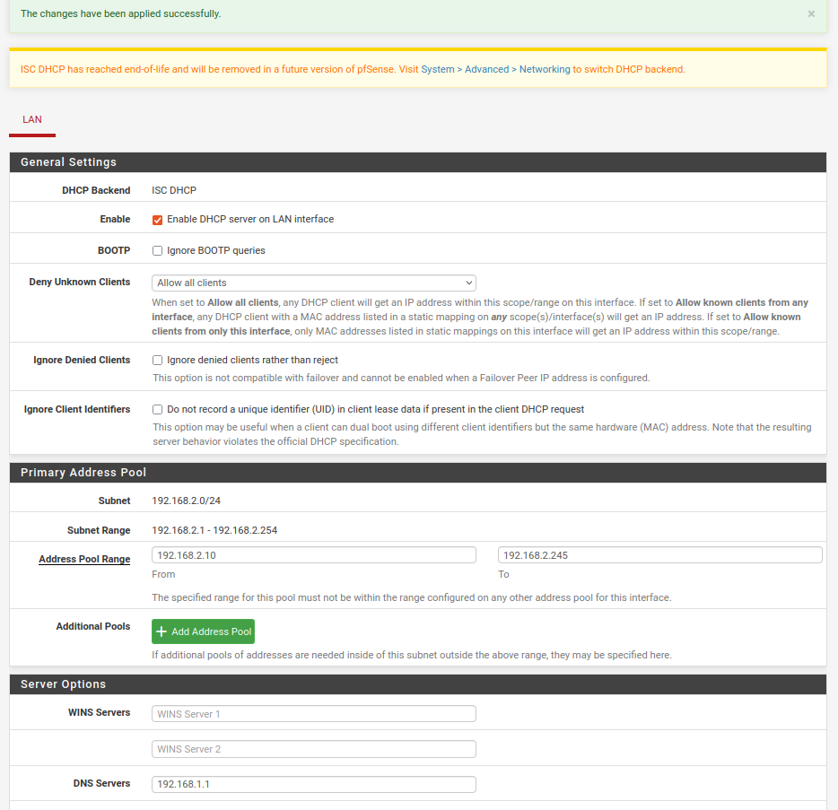

| Field | Value |
|---|---|
| Range | 192.168.2.10 – 192.168.2.199 |
| DNS server | 192.168.1.254 (home router) |

---

## Part 2 — Attack Simulation and Detection

### 2.1 Verifying Host Connectivity

**Ubuntu (Victim):**

```bash
sudo apt update
sudo apt install net-tools
ifconfig
ping 8.8.8.8
```

Confirms Ubuntu received an address in the `192.168.2.0/24` range via DHCP and has outbound internet access through pfSense.

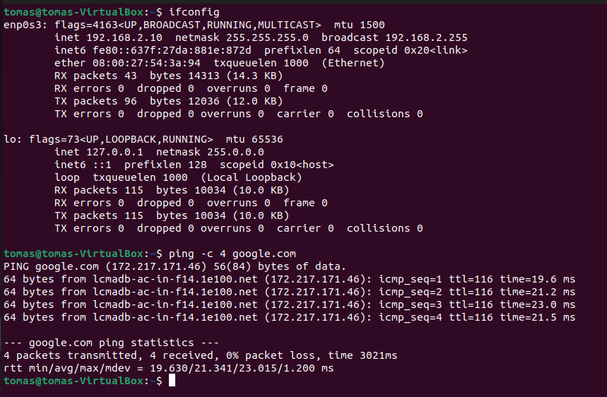


**Kali (Attacker):**

```bash
ifconfig
ping 192.168.1.162
```
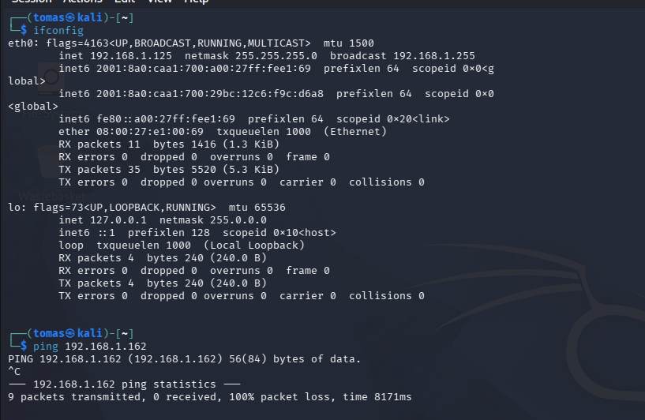


Pinging the pfSense WAN address initially failed. Two separate issues on pfSense were responsible:

1. **"Block private networks" on WAN.** By default, pfSense drops inbound traffic on the WAN interface that originates from RFC1918 private addresses, since WAN traffic is normally expected to come from the public internet. Since this entire lab runs on private ranges, this default rule silently dropped all of Kali's traffic. Fix: **Interfaces ▸ WAN** → uncheck *"Block private networks and loopback addresses"* under Reserved Networks.
2. **No explicit rule allowing Kali's traffic.** A rule was added on **Firewall ▸ Rules ▸ WAN** to allow ICMP from Kali's IP toward pfSense/Ubuntu.

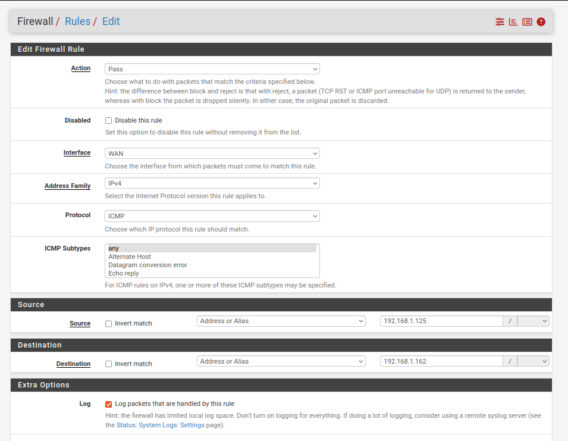


Once both were addressed, the ping succeeded:

```bash
ping 192.168.1.162
```
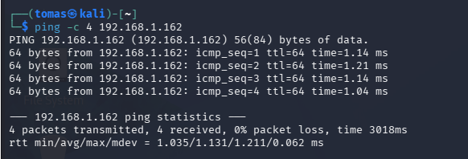


### 2.2 Allowing Kali → Ubuntu Traffic

A firewall rule was added on **Firewall ▸ Rules ▸ WAN** to allow traffic from Kali toward the Ubuntu victim:

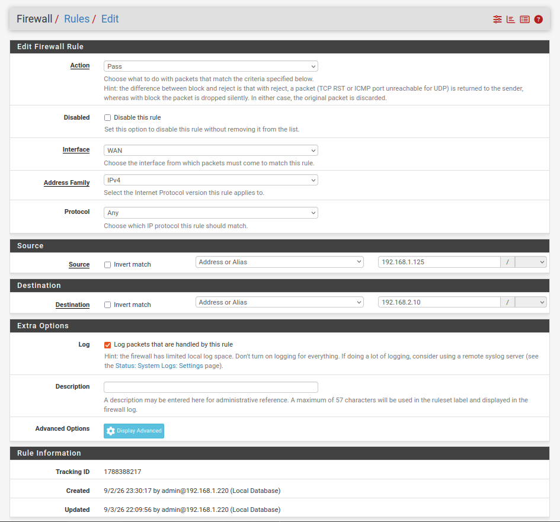

| Field | Value |
|---|---|
| Action | Pass |
| Protocol | Any |
| Source | 192.168.1.125 (Kali) |
| Destination | 192.168.2.10 (Ubuntu) |
| Description | Allow Kali access to Ubuntu |

> **Note on protocol:** an initial rule restricted to ICMP allowed `ping` to succeed but silently blocked the later `hping3` TCP traffic. The rule protocol was widened to `Any` to allow the attack traffic through for this demonstration — a real-world equivalent of an attacker who has already found an open path to the target.

A static route was added on Kali so that return/forward traffic for the internal `192.168.2.0/24` subnet is correctly routed via the pfSense WAN address, since Kali has no direct knowledge of the internal LAN:

```bash
sudo ip route add 192.168.2.0/24 via 192.168.1.162
```

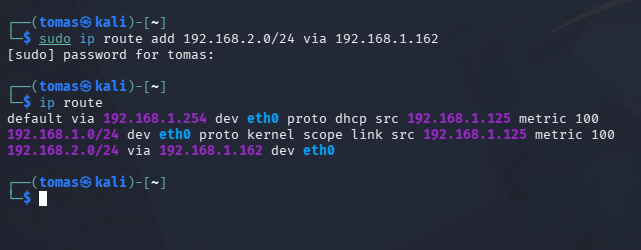


Successfull pings now:

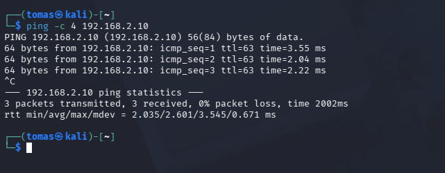


### 2.3 Installing Wireshark (Ubuntu)

```bash
sudo apt install wireshark
sudo wireshark
```
Capture was started on the primary interface (`enp0s3`) to observe incoming traffic during the attack.


### 2.4 Simulating the DoS Attack

From Kali, a SYN flood was launched against the Ubuntu victim on port 80:

```bash
sudo hping3 -S -p 80 --flood 192.168.2.10
```

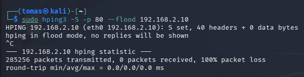

**On the reported packet loss:** in `--flood` mode, `hping3` disables response listening entirely in order to maximize send throughput — it never checks for replies, so `packets received` is always 0 and the reported loss is not a measure of whether the attack succeeded. Delivery of the attack traffic was instead confirmed independently through:

- **pfSense rule counters** (Firewall ▸ Rules ▸ WAN), showing the Kali → Ubuntu rule matching tens of thousands of packets during the attack window
- **Wireshark capture on Ubuntu**, showing a continuous stream of incoming SYN packets from Kali's IP

This is the expected behavior of a SYN flood: the goal isn't to receive replies, but to exhaust the victim's connection-handling resources with a high volume of half-open TCP connection requests.


### 2.5 Observing the Attack in Wireshark

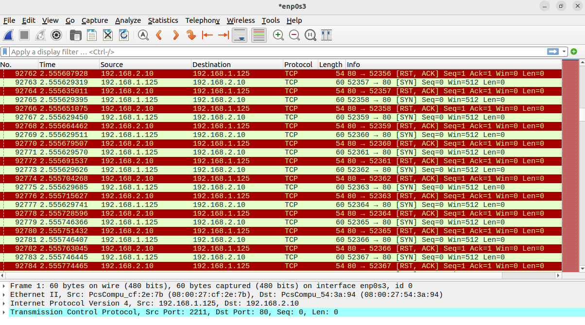

The capture shows a sustained flood of `SYN` packets from Kali's IP (`192.168.1.125`) to Ubuntu's IP (`192.168.2.10`) on port 80, with no corresponding `SYN-ACK`/`ACK` handshake completion — consistent with a SYN flood pattern.

---


## Part 3 — Mitigation

### 3.1 Blocking Kali → Ubuntu TCP Traffic

To stop the attack, a **block** rule was added on **Firewall ▸ Rules ▸ WAN**:

| Field | Value |
|---|---|
| Action | Block |
| Protocol | TCP |
| Source | Kali IP |
| Destination | Ubuntu IP |

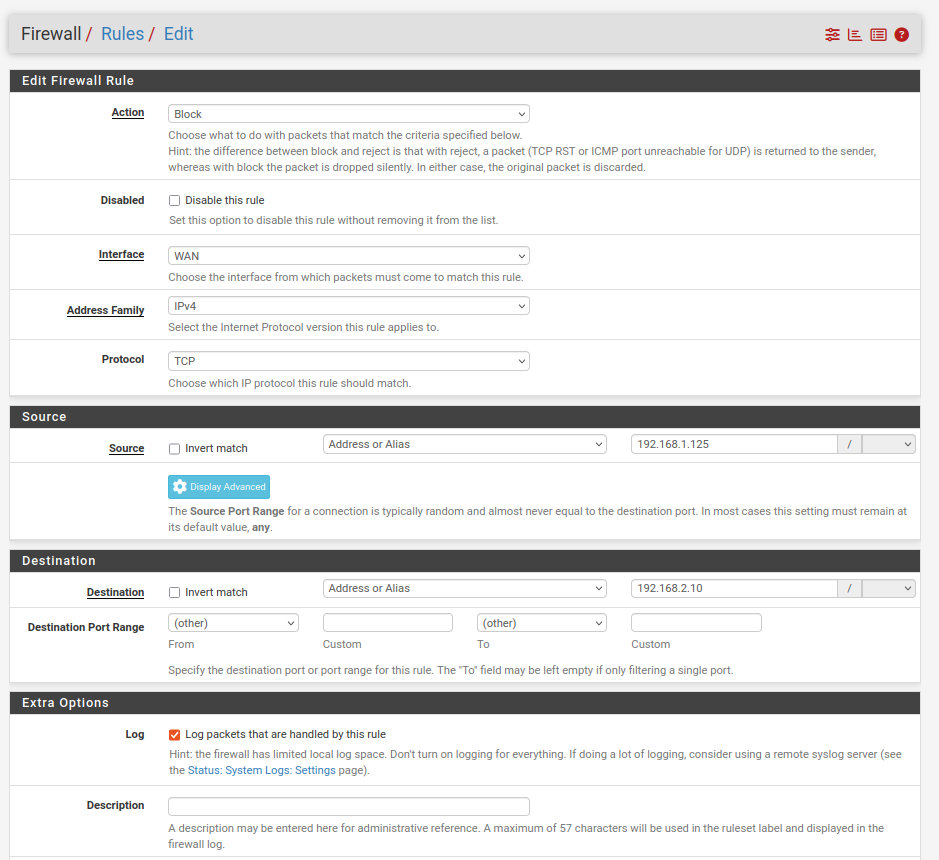

pfSense evaluates rules top-to-bottom on the interface and applies the **first match**, so this block rule was placed above the earlier "Allow Kali access to Ubuntu" rule — otherwise the permissive rule would keep matching first and the block would never be reached.


### 3.2 Re-running the DoS Attack

The same attack was launched again from Kali to test the new rule:

```bash
sudo hping3 -S -p 80 --flood 192.168.2.10
```

This time, **396,968 packets** were transmitted:

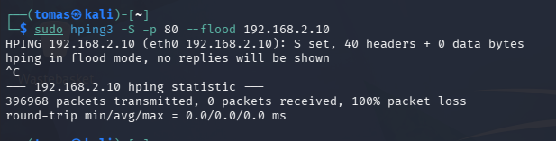

### 3.3 Verifying the Block in pfSense

Checking **Firewall ▸ Rules ▸ WAN** confirms the new rule caught the traffic: **396,963 packets blocked**, matching the volume sent by Kali. This confirms the rule is working as intended — the flood is being dropped at the firewall instead of reaching the internal network.

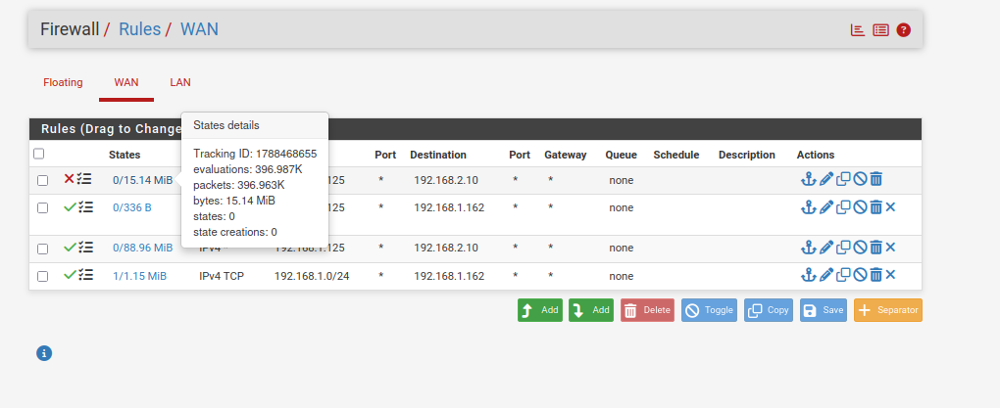

---

## Troubleshooting

A few issues came up during setup that are worth documenting, since they're common pitfalls in this kind of lab.

**DNS resolution failing despite working internet connectivity**

While verifying the Ubuntu VM, `sudo apt install net-tools` failed to run. Diagnosis steps:

1. Checked connectivity to the default gateway — worked
2. Checked `ping 8.8.8.8` — worked (confirms raw IP routing is fine)
3. Checked `ping google.com` — failed (points specifically to DNS resolution, not routing)

Since IP-based connectivity worked but name resolution didn't, the issue was narrowed down to an incorrect DNS server rather than a network/firewall problem. Running `ip route | grep default` on the host machine's own connection confirmed the actual home router address is `192.168.1.254` — not `192.168.1.1`, which had been assumed and configured as the DNS server in pfSense.

**Fix:** in the pfSense GUI, under **Services ▸ DHCP Server ▸ LAN**, the DNS Servers field was updated to `192.168.1.254`. Ubuntu picked up the corrected DNS server on its next DHCP renewal, and both `apt` and `ping google.com` started working.

> **Takeaway:** when IP-based tests succeed but name-based tests fail, the issue is almost always DNS — check the resolver configuration before suspecting routing or firewall rules.


## Part 4 — IDS/IPS with Suricata

With manual firewall rules already demonstrated in Part 3, Suricata was added on top of pfSense to move from static, hand-written blocking toward signature-based intrusion detection and prevention.

### 4.1 Installing Suricata

Installed via **System ▸ Package Manager ▸ Available Packages**, searching for `Suricata` and installing the package.

### 4.2 Adding Suricata to the WAN Interface

Under **Services ▸ Suricata ▸ Interfaces ▸ Add**, Suricata was bound to the WAN interface — the same interface Kali's traffic enters through:

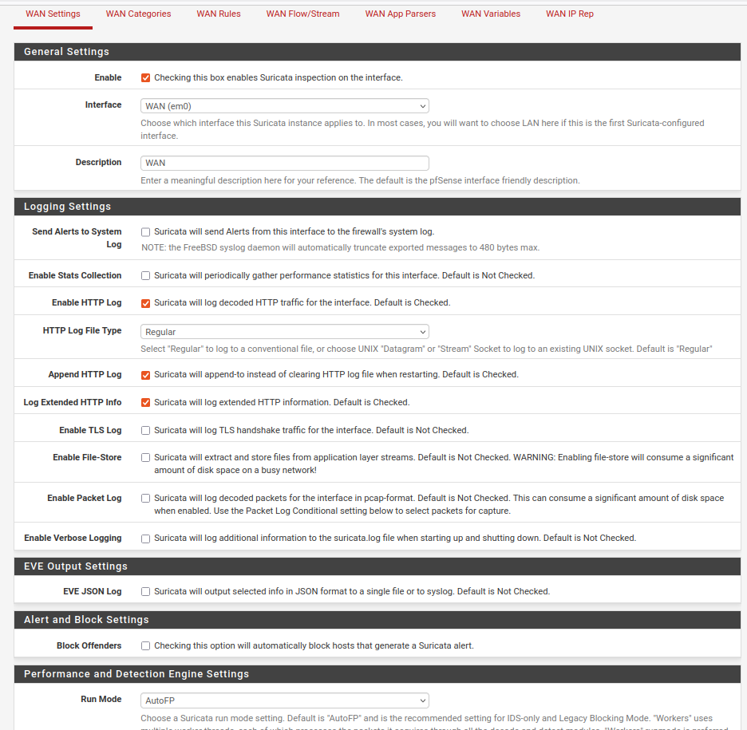

### 4.3 Disabling Hardware Offloading

After saving, pfSense raised a warning that Suricata requires **Hardware Checksum Offloading**, **Hardware TCP Segmentation Offloading**, and **Hardware Large Receive Offloading** to all be disabled for correct packet inspection — these offloading features can cause the NIC to present checksums/segments to Suricata in a way it can't correctly parse, leading to missed or malformed detections.

Fixed under **System ▸ Advanced ▸ Networking**, by enabling:

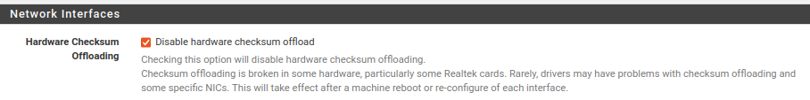

- **Disable hardware checksum offload**

pfSense re-configured the interfaces after this change to apply it.

### 4.4 Enabling Block Offenders (IPS Mode)

On the WAN interface's Suricata settings, the following option was enabled:

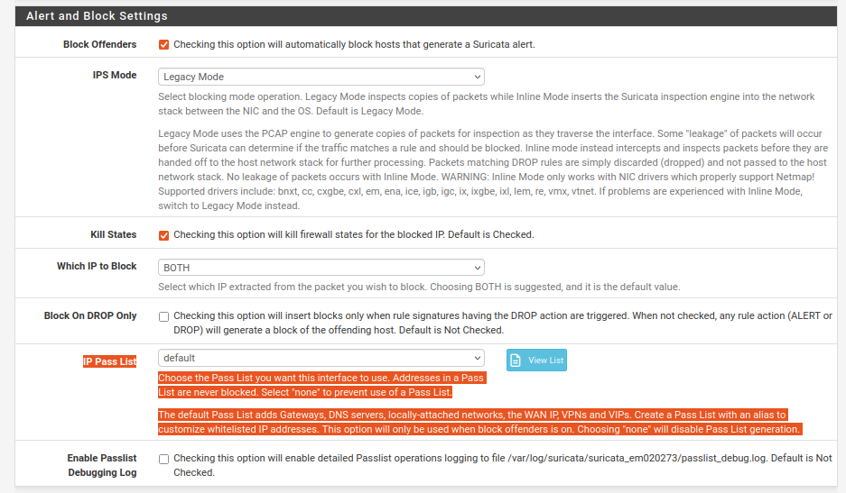

- **Block Offenders** — automatically blocks any host that triggers a Suricata alert, turning Suricata from a passive IDS into an active IPS.

### 4.5 Selecting Rule Sources

Under **Global Settings**, rule sources were configured (e.g. the ET Open ruleset):

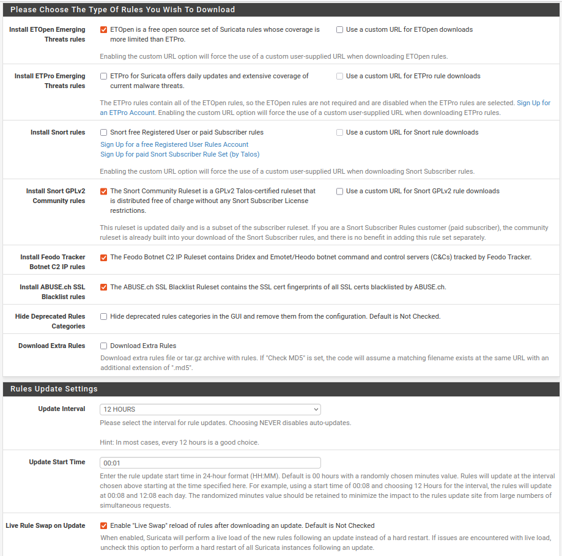

Settings were saved, and the rules were downloaded from **Updates ▸ Update**.

Downloading the ruleset alone does not enable any detection — each rule category has to be explicitly turned on per interface. Under **Interfaces ▸ WAN ▸ Categories**, the following categories were enabled:

✅ emerging-scan.rules

✅ emerging-dos.rules

### 4.6 Next: Testing Detection

To observe Suricata's detection in isolation, the manual block rule from Part 3 was temporarily disabled — otherwise Kali's traffic would never reach the point of triggering a Suricata alert.

A port scan was then run from Kali:

```bash
sudo nmap -sS 192.168.2.10
```

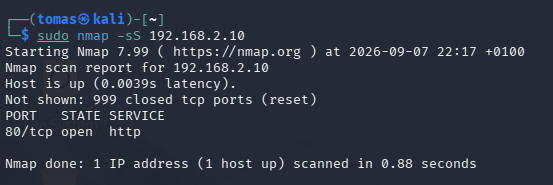


Checking **Services ▸ Suricata ▸ Alerts** shows multiple alerts triggered by the scan, without writing a single manual rule:

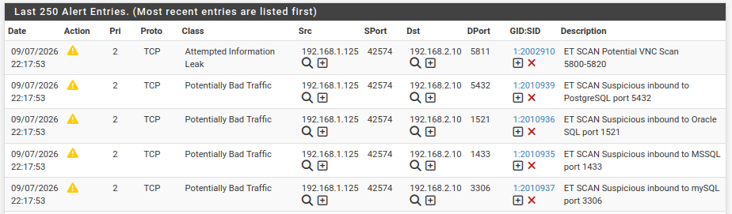


The same events are visible under **Log View ▸ alerts-log**:

```09/07/2026-22:17:53.737968  [**] [1:2010937:3] ET SCAN Suspicious inbound to mySQL port 3306 [**] [Classification: Potentially Bad Traffic] [Priority: 2] {TCP} 192.168.1.125:42574 -> 192.168.2.10:3306
09/07/2026-22:17:53.818810  [**] [1:2010935:3] ET SCAN Suspicious inbound to MSSQL port 1433 [**] [Classification: Potentially Bad Traffic] [Priority: 2] {TCP} 192.168.1.125:42574 -> 192.168.2.10:1433
09/07/2026-22:17:53.875462  [**] [1:2010936:3] ET SCAN Suspicious inbound to Oracle SQL port 1521 [**] [Classification: Potentially Bad Traffic] [Priority: 2] {TCP} 192.168.1.125:42574 -> 192.168.2.10:1521
09/07/2026-22:17:53.876699  [**] [1:2010939:3] ET SCAN Suspicious inbound to PostgreSQL port 5432 [**] [Classification: Potentially Bad Traffic] [Priority: 2] {TCP} 192.168.1.125:42574 -> 192.168.2.10:5432
09/07/2026-22:17:53.990109  [**] [1:2002910:6] ET SCAN Potential VNC Scan 5800-5820 [**] [Classification: Attempted Information Leak] [Priority: 2] {TCP} 192.168.1.125:42574 -> 192.168.2.10:5811
```

Each alert corresponds to a probe against a well-known service port (MySQL, MSSQL, Oracle, PostgreSQL, VNC) — exactly the behavior an `nmap` SYN scan produces, and detected purely through Suricata's Emerging Threats signatures, with no custom rule written for this scenario.


### 4.7 Writing a Custom Detection Rule

Beyond the pre-built Emerging Threats categories, a custom Suricata rule was written to alert on inbound ICMP traffic toward the pfSense WAN address — the same type of traffic used earlier in the project to test connectivity.

Added under **Services ▸ Suricata ▸ WAN (em0) ▸ WAN Rules**, category **`custom.rules`**:

```
alert icmp any any -> 192.168.1.162 any (msg:"ICMP traffic detected"; itype:8; sid:1000001; rev:1;)
```

- `itype:8` — matches ICMP Echo Request (ping) packets specifically
- `sid:1000001` — custom rules require a Signature ID outside the range used by the official rulesets (1–1,000,000 is reserved)

**Test — pinging pfSense from Kali:**

```bash
ping -c 4 192.168.1.162
```
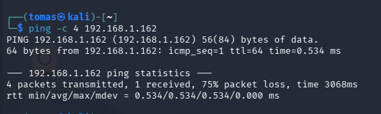

Only **1 of the 4** packets received a reply (**75% packet loss**) — a direct result of Block Offenders reacting to the very first alert and blocking Kali's IP before the remaining pings could go through.


**Alerts generated in Suricata:**

All 4 ICMP echo requests were logged as individual alerts, confirming the custom rule matched as expected:

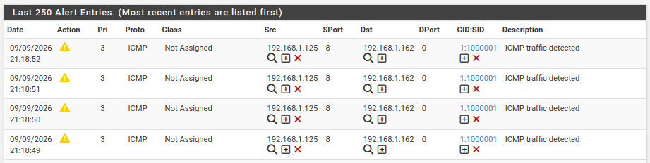


**Automated block confirmed:**

Since **Block Offenders** (IPS mode) was already enabled on the WAN interface (section 4.4), the very first alert was enough to automatically add Kali's IP to the blocked hosts list — with no manual firewall rule involved:

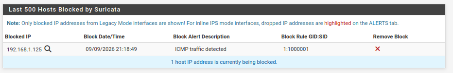

This closes the loop for the IDS/IPS section: a **custom signature** detected the traffic, and the existing **IPS enforcement** acted on it automatically — the same detect-and-block pipeline demonstrated earlier with the pre-built scan rules, now driven by a rule written specifically for this lab.

---

## Troubleshooting

A few issues came up during setup that are worth documenting, since they're common pitfalls in this kind of lab.

**DNS resolution failing despite working internet connectivity**

While verifying the Ubuntu VM, `sudo apt install net-tools` failed to run. Diagnosis steps:

1. Checked connectivity to the default gateway — worked
2. Checked `ping 8.8.8.8` — worked (confirms raw IP routing is fine)
3. Checked `ping google.com` — failed (points specifically to DNS resolution, not routing)

Since IP-based connectivity worked but name resolution didn't, the issue was narrowed down to an incorrect DNS server rather than a network/firewall problem. Running `ip route | grep default` on the host machine's own connection confirmed the actual home router address is `192.168.1.254` — not `192.168.1.1`, which had been assumed and configured as the DNS server in pfSense.

**Fix:** in the pfSense GUI, under **Services ▸ DHCP Server ▸ LAN**, the DNS Servers field was updated to `192.168.1.254`. Ubuntu picked up the corrected DNS server on its next DHCP renewal, and both `apt` and `ping google.com` started working.

> **Takeaway:** when IP-based tests succeed but name-based tests fail, the issue is almost always DNS — check the resolver configuration before suspecting routing or firewall rules.


## Repository

**Name:** `PfSense-Firewall-IDS-IPS-Lab`
**Description:** Virtualized lab simulating a DoS attack and port scan from an external host against a pfSense-protected network, with traffic capture in Wireshark, manual firewall-rule mitigation, and automated detection/blocking via a Suricata IDS/IPS with custom signatures.
