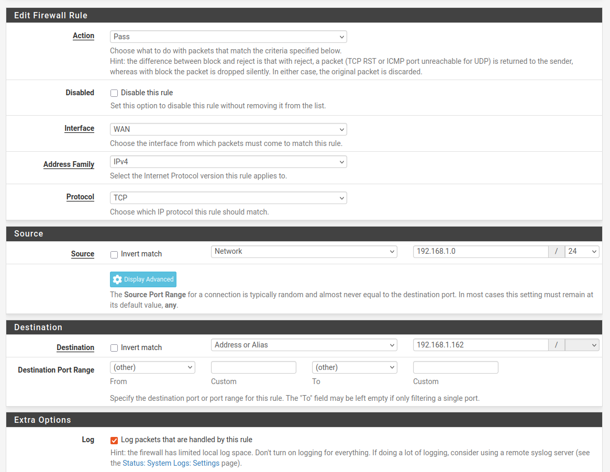

# pfSense Firewall Lab — DoS Attack Simulation & Mitigation

## Overview

This project sets up a small virtualized network to simulate an external attacker targeting an internal host protected by a pfSense firewall. The lab consists of three virtual machines — pfSense (firewall), Kali Linux (attacker), and Ubuntu Desktop (victim) — used to demonstrate a Denial-of-Service (DoS) attack, capture it with Wireshark, and mitigate it using firewall rules.

**Status:** pfSense installation and network configuration complete. Ubuntu VM in progress. Kali VM, attack simulation, and mitigation still pending.

## Lab Architecture

| Device | Network | IP / Subnet | Role |
|---|---|---|---|
| Home Network | Physical | 192.168.1.0/24 | Provides internet access |
| pfSense — WAN | Bridged | 192.168.1.162/24 (DHCP) | Edge firewall interface facing home network |
| pfSense — LAN | Internal (`intnet`) | 192.168.2.1/24 | Internal firewall interface |
| Kali Linux (Attacker) | Bridged | TBD | External attacker host |
| Ubuntu Desktop (Victim) | Internal (`intnet`) | 192.168.2.100–199 (DHCP) | Internal victim host |

## Part 1 — Installation and Configuration

### 1.1 Virtual Machines

**pfSense**
- FreeBSD 64-bit, 2 vCPU, 2 GB RAM, 20 GB disk
- Adapter 1: Bridged (WAN)
- Adapter 2: Internal Network → `intnet` (LAN)
- Installed edition: pfSense CE (Community Edition)
- Filesystem: ZFS (Stripe, single disk)

**Ubuntu Desktop (Victim)**
- Ubuntu 64-bit, 2 vCPU, 2 GB RAM, 15 GB disk
- Adapter 1: Internal Network → `intnet`

**Kali Linux (Attacker)**
- Ubuntu 64-bit, 2 vCPU, 2 GB RAM, 15 GB disk
- Adapter 1: Bridged (WAN)

### 1.2 Interface Assignment

Interfaces were assigned via the pfSense console:
- WAN → `em0`
- LAN → `em1`

### 1.3 Network Addressing

The LAN interface was manually set to `192.168.2.1/24` to avoid a subnet conflict with the home network (which also uses `192.168.1.0/24`). IPv6 was disabled, and HTTPS was kept as the webConfigurator protocol.

### 1.4 Enabling GUI Access

The firewall was temporarily disabled from the console shell (`pfctl -d`) to allow first-time login to the web interface at `https://192.168.1.162` using the default credentials (`admin` / `pfsense`).

A permanent firewall rule was then created to allow GUI access going forward:

| Field | Value |
|---|---|
| Interface | WAN |
| Action | Pass |
| Protocol | TCP |
| Source | Network: 192.168.1.0/24 |
| Destination | WAN address |
| Destination port | 443 |
| Description | Allow GUI access from home network |

### 1.5 DHCP Server (LAN)

Configured under **Services ▸ DHCP Server ▸ LAN**:

| Field | Value |
|---|---|
| Range | 192.168.2.100 – 192.168.2.199 |
| DNS server | 192.168.1.1 (home router) |

## Next Steps

- [ ] Finish Ubuntu installation and confirm assigned IP
- [ ] Create Kali Linux VM (Bridged)
- [ ] Add WAN firewall rule allowing Kali → Ubuntu traffic
- [ ] Run DoS attack using `hping3`
- [ ] Capture and analyze traffic in Wireshark
- [ ] Mitigate the attack with pfSense firewall rules
- [ ] Review resulting firewall logs
